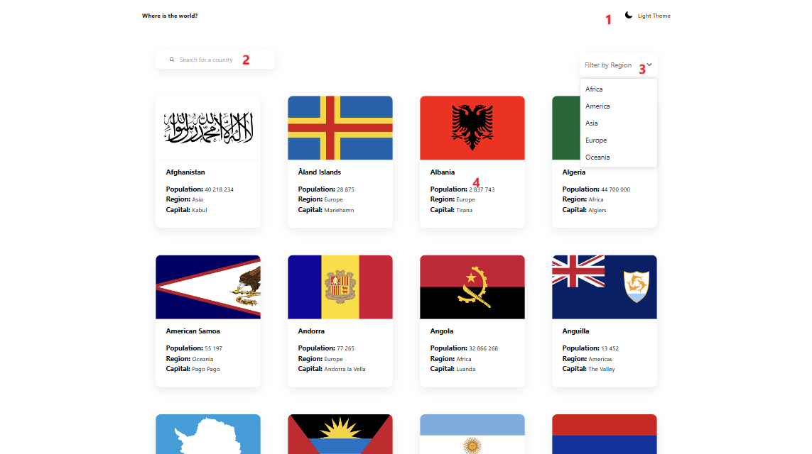
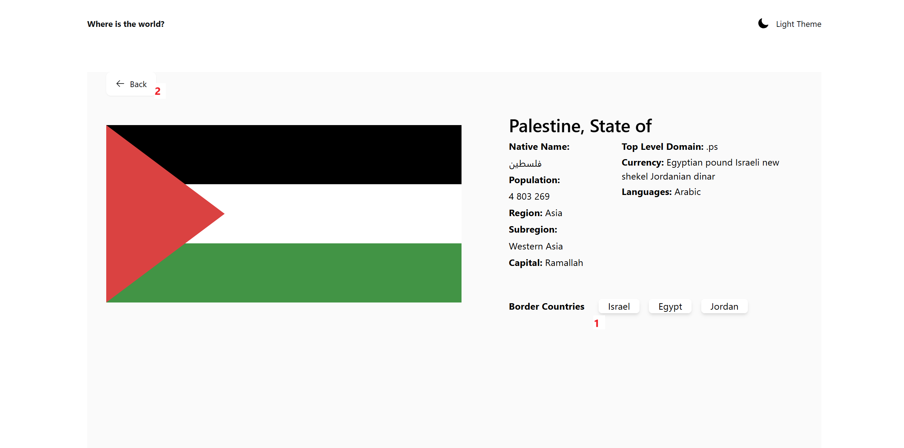

<a id="anchor"></a>

# Multipage Country List 
The web application includes list of all current countries with dinamic route:

User enters a name's country in the search field and receives matched items. Also there is filtering by Region (_Europe, Asia, Africa, America, Oceania_). Each County Card is clickable and includes such info as:
* Native Name, 
* Population, 
* Region, 
* Subregion, 
* Capital,
* Top Level Domain, 
* Currency, 
* Languages,
* Border Countries.

Border Countries Component is composed of Country List with Current State's Border. It's also clickable and redirectes user to another Country page  

***

The project is written due to __Vite__ + __ReactJS__ + __Redux Toolkit__ + __TypeScript__ + __TailwindCSS__

Other libraries: __heroicons/react__ + __react-select__ + __axios__ + __framer-motion__ + __react-intersection-observer__ + __styled-components__

***

### Page structure:

1. Main
2. Details
3. Not Found

***

### Instruction:
* Main Page



1. Change Theme (Light-Dark)
2. Search Name field
3. Search Region field
4. Country Card

* Bookmarks Page



1. Clickable country block/name
2. Back buton

Feature 
: All of countries have their own ID, that's why dinamic routing is the best option for getting info about selected country

```
const Details = () => {
  let { name } = useParams();
  const navigate = useNavigate();
  const [country, setCountry] = useState<Country[]>();

  useEffect(() => {
    axios.get(searchByCountry(name || '')).then(
      ({data}) => setCountry(data[0])
    )
  }, [name]);

  return (
    <div 
      className="px-8 min-h-screen bg-[#fafafa] dark:bg-secondary_dark"
    >
      <Button>
        <div 
          className="flex items-center gap-2 px-4 py-1.5"
          onClick={() => navigate(-1)}
        >
          <ArrowLeftIcon className="w-4 h-4" />
          <span className="text-sm">Back</span>
        </div>
      </Button>
        {country && (
          <Info name={""} nativeName={""} population={0} region={""} subregion={""} capital={""} borders={[]} topLevelDomain={[]} currencies={[]} languages={[]} flag={""} navigate={navigate} {...country} />
        )}
    </div>
  )
}

export default Details
```

[Up](#anchor)